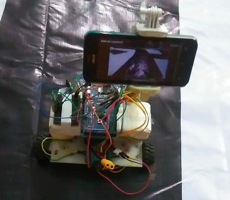
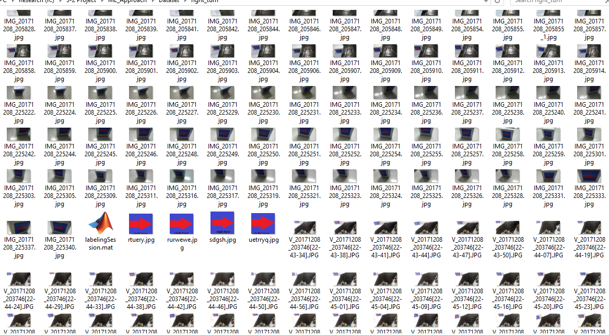
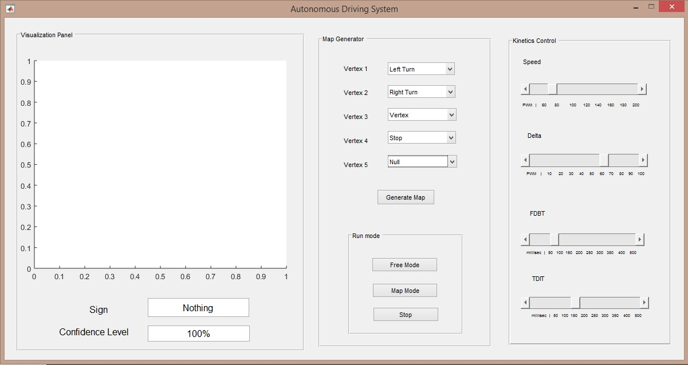
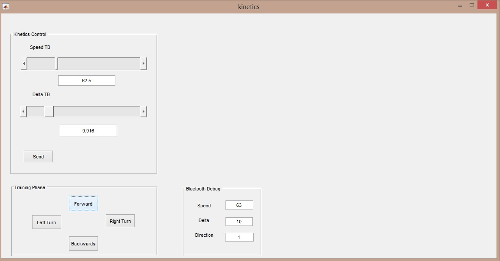

# autonomous-driving-system
'Autonomous driving system with Machine Learning' in Matlab
----------------------------------------------------------------------------------------------------------

https://youtu.be/jWo3Bg04RmQ (minimal version)

> A lightweight version of my training dataset can be found here  https://drive.google.com/drive/folders/13di9ZXnvaAopzrtEesW_rOduIqcoapxg?usp=sharing

`I developed a toolbox to calibrate the car and get the images for training mode easily, used a simple distributed computing 
system with two laptops to speed up processing, ad-hoc image processing technique for lane detection and 
cascade classifiers for road sign detection`

